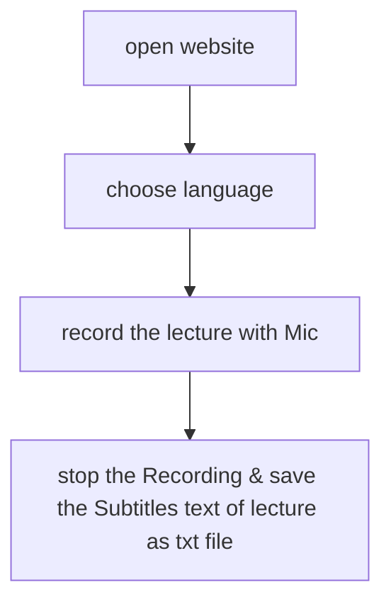

# Stakeholder

- Student
  - fast, Multi-Lingual, easy 
- Professor
  - sicher, easy
- (Developer)
  - easy to build
- (Uni Verwaltung)
  - Gesetze, Daten-Schutz, Manage 
- (Data Sicherheit Manager)
  - Sicherheit

# Sequence Requirement

# User Storys

- Students
  - As a Student I wanna read the Subtitles of Professor live time, for Understanding the lecture better.
  - As a Student I wanna save my Subtitles, because I need it for my study later.

- Professor
  - As a Professor I wanna show the Subtitles of my voice, to make Comprehetion of foreign students easier.
  - As a Professor I wann save the Subtitles, cause I should check my speech.

# Features

- Speech Recognition with Web API.
- Save the Subtitles file.
- Authentication

